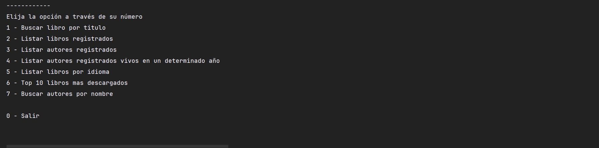

# LiteraAlura


En este proyecto se desarrollo una pequeña aplicacion de consola
que consume la API `Gutendex-API`, en la cual se encuentran una amplia variedad de libros
de multiples autores y epocas. Una vez consultados los libros quedan almacenados en
una base de datos Postgresql

### Características

* Consultar libros por titulo en la API
* Listar libros registrados
* Listar autores registrados
* Listar autores registrados vivos en un determinado año
* Listar libros por idioma
* Top 10 libros mas descargados
* Buscar autores por nombre


### Tecnologías Utilizadas

* Java
* Spring Boot
* Jackson
* JPA
* Postman
* Postgresql


### Instalación

1. Primero debes clonar el repositorio:
   >https://github.com/josemina/literalura.git

   Accede al directorio:
   >cd literalura

2. Crea la base de datos en MySQL
   ```sql
   CREATE DATABASE literalura;
   ```
3. Compilar y ejecutar la aplicación
   >mvn clean install
   >
   >mvn spring-boot:run

   


### Autor
Jose Mina [Linkedin](https://www.linkedin.com/in/joseminac/)